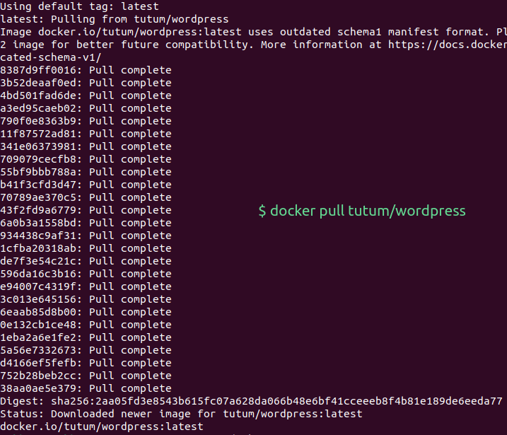
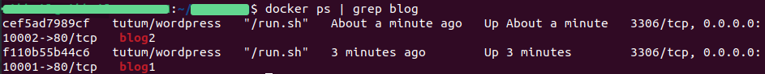
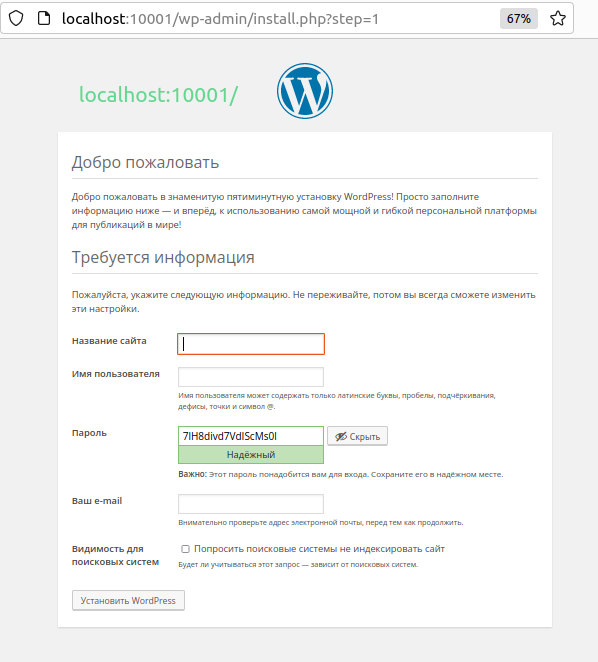

# 🔖 Использование портов для подключения к контейнерам
Контейнеры Docker изначально разрабатывались для запуска служб.
В большинстве случаев это те или иные HTTP-службы. Значительную часть из
них составляют веб-сервисы, доступные через браузер.

Это приводит к проблеме. Если у вас есть несколько Docker-контейнеров, работающих 
на _**порту 80**_ во внутренней среде, они не могут быть
доступны через порт 80 на вашем хост-компьютере.

## ❓ Проблема
Вы хотите сделать несколько служб контейнера Docker доступными
для порта на вашем хост-компьютере.

## ✅ Решение 
Используйте флаг `-p` для отображения порта контейнера в свой хост-компьютер.
В этом примере мы будем использовать образ _tutum-wordpress_. Допустим,
вы хотите запустить два из них на своем хост-компьютере для обслуживания
разных блогов.

Чтобы получить образы из внешних источников, используйте 
команду `docker pull`. По умолчанию образы будут загружаться из Docker Hub:
```bash
$ docker pull tutum/wordpress
```
Вывод команды представлен ниже:



Образы также будут получены автоматически, когда вы попытаетесь запустить их, если их еще нет на вашем компьютере.
Чтобы запустить первый блог, используйте следующую команду:
```bash
$ docker run -d -p 10001:80 --name blog1 tutum/wordpress
```
Команда `docker run` запускает контейнер как **_демон (-d)_** с флагом (-p). Она
идентифицирует порт хоста (10001) для отображения в порт контейнера (80)
и присваивает контейнеру имя, чтобы его идентифицировать (--name blog1
tutum/wordpress).

Вы можете сделать то же самое для второго блога:
```bash
$ docker run -d -p 10002:80 --name blog2 tutum/wordpress
```

Если выполнить эту команду:
```bash
$ docker ps | grep blog
```
то можно увидеть два перечисленных контейнера блогов с пробросом портов, кото-
рые выглядят так:



Теперь можно получить доступ к своим контейнерам, перейдя по адресам:
`http://localhost:10001` и `http://localhost:10002`.




Чтобы удалить контейнеры по окончании (при условии, что вы не хотите
их сохранять), выполните следующую команду:
```bash
$ docker rm -f blog1 blog2
```
Вывод команды `docker rm` представлен ниже:
```text
blog1
blog2
```
Теперь вы сможете запускать несколько идентичных образов и служб на своем хосте, самостоятельно управляя распределением портов, если это необходимо.

> **ПОДСКАЗКА**. При использовании флага `-p` можно легко забыть, какой порт является хостом, 
> а какой – контейнером. Мы представляем себе это как читать предложение слева направо. Пользователь 
> подключается к хосту (-p), и порт хоста передается на порт контейнера `(host_port: container_port)`. 
> Кроме того, это тот же формат, что и SSH-команды для переадресации портов, если вы с ними знакомы.

