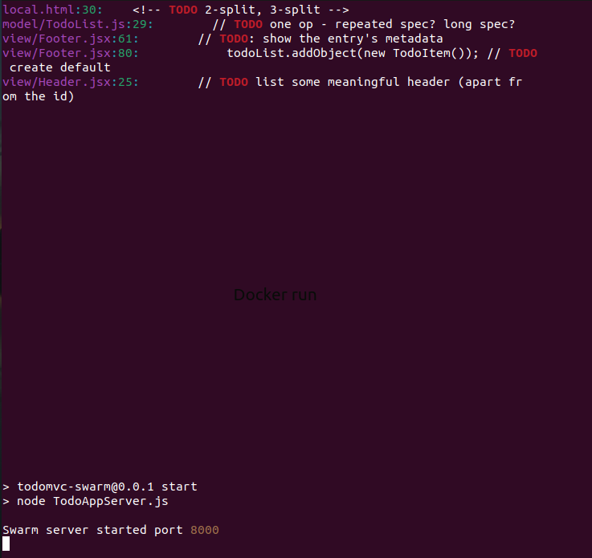
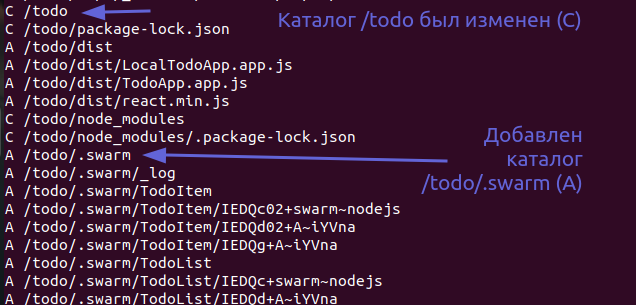
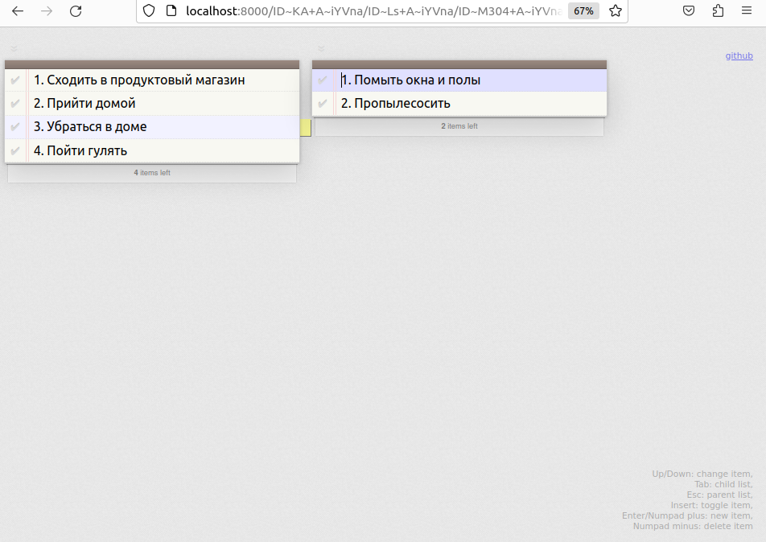

# Docker-Tutorial
Instructions for working with Docker (starting a container, creating an image)

## 📝 Пишем Dockerfile (Write Dockerfile)
Dockerfile - текстовый файл, содержащий серию команд.
Заведите новую папку, перейдите в нее и создайте файл 
с именем "Dockerfile" (без расширения).

Dockerfile находится в репозитории, поэтому Вы можете ознакомиться
с его содержимым.

Инструкции Dockerfile с краткими комментариями:

1. `FROM` — задаёт базовый (родительский) образ
2. `LABEL` — описывает метаданные. Например — сведения о том, кто создал и поддерживает образ.
3. `ENV` — устанавливает постоянные переменные среды.
4. `RUN` — выполняет команду и создаёт слой образа. Используется для установки в контейнер пакетов.
5. `COPY` — копирует в контейнер файлы и папки.
6. `ADD` — копирует файлы и папки в контейнер, может распаковывать локальные .tar-файлы.
7. `CMD` — описывает команду с аргументами, которую нужно выполнить когда контейнер будет запущен. 
Аргументы могут быть переопределены при запуске контейнера. В файле может присутствовать лишь одна инструкция CMD.
8. `WORKDIR` — задаёт рабочую директорию для следующей инструкции.
9. `ARG` — задаёт переменные для передачи Docker во время сборки образа.
10. `ENTRYPOINT` — предоставляет команду с аргументами для вызова во время выполнения контейнера. 
Аргументы не переопределяются.
11. `EXPOSE` — указывает на необходимость открыть порт.
12. `VOLUME` — создаёт точку монтирования для работы с постоянным хранилищем.
<details>
  <summary>English version</summary>

Dockerfile is a text file containing a series of commands.
Create a new folder, go to it and create a file named "Dockerfile".

Dockerfile is located in the repository, so you can familiarize
yourself with its contents.

Instructions with brief comments:
1. `FROM` — sets the base (parent) image
2. `LABEL` — describes metadata. For example, information about who created and maintains the image.
3. `ENV` — sets constant environment variables.
4. `RUN` — executes the command and creates an image layer. Used to install packages into the container.
5. `COPY` — copies files and folders to the container.
6. `ADD` — copies files and folders to the container, can unpack local .tar files.
7. `CMD` — describes the command with arguments to be executed when the container is launched.
   The arguments can be overridden when the container is started. Only one CMD instruction can be present in the file.
8. `WORKDIR` — sets the working directory for the next instruction.
9. `ARG` — sets variables to pass to Docker during image build.
10. `ENTRYPOINT` — provides a command with arguments to call during container execution. Arguments are not overridden.
11. `EXPOSE` — indicates the need to open the port.
12. `VOLUME` — creates a mount point for working with persistent storage.
</details>

## ⚙️ Собираем образ Docker (Building a Docker image)
Чтобы собрать образ Docker, необходимо набрать команду, 
показанную ниже:
```bash
$ docker build path_to_dockerfile
```
где **path_to_dockerfile** - путь к вашему Dockerfile

Выполнив данную команду, Вы получите образ Docker со своим идентификатором
(например, "66c76cea05bb"). К идентификатору неудобно обращаться,
поэтому Вы можете присвоить ему тег для удобства. 
Чтобы присвоить тег, введите следующую команду:
```bash
$ docker tag your_image_identifier tag_name
```
где **your_image_identifier** - сгенерированный идентификатор,
**tag_name** - имя тега, которое Вы придумали.

Просмотреть список локальных образов можно следующим образом:
```bash
$ docker images -a
```
Вывод команды будет выглядеть примерно так:
```bash
REPOSITORY   TAG       IMAGE ID       CREATED        SIZE
todoapp      latest    2896ad0b56d0   3 hours ago    1.2GB
```
Теперь Вы можете собрать свою собственную копию образа Docker
из файла Dockerfile, воспроизводя среду, определенную кем-то другим.

<details>
<summary> English version </summary>

To build a Docker image, you need to type the command
shown below:

```bash
docker build path_to_dockerfile
```
**path_to_dockerfile** - is the path to your Dockerfile.

By executing this command, you will get a Docker image with your ID
(for example, "66c76cea05bb"). The identifier is inconvenient to access,
so you can assign it a tag for convenience.
To assign a tag, type the following command:
```bash
$ docker tag your_image_identifier tag_name
```
**_your_image_identifier_** is the generated identifier,
**_tag_name_** - the name of the tag that you came up with.

You can view the list of local images as follows:
```bash
$ docker images -a
```
The result of executing the command will look something like this:
```bash
REPOSITORY   TAG       IMAGE ID       CREATED        SIZE
todoapp      latest    2896ad0b56d0   3 hours ago    1.2GB
```
Now you can build your own copy of the Docker image
from the Dockerfile, reproducing the environment defined by someone else.
</details>

## 🚀 Запускаем контейнер Docker (Launching a Docker container)
Итак, мы собрали образ Docker и присвоили ему тег. Теперь мы можем
запустить его в качестве контейнера:
```bash
$ docker run -i -t -p 8000:8000 --name example1 todoapp
```
Подкоманда `docker run` запускает контейнер. Флаг `-p` перенаправляет порт
контейнера **8000** в **порт 8000 на хост-компьютере**, поэтому теперь Вы можете перейти
в своем браузере по адресу `http://localhost:8000` для просмотра приложения. 

Флаг `-name` присваивает контейнеру уникальное имя, к которому вы можете обратиться позже для 
удобства. Последний аргумент - это имя образа.

Запуск команды `docker run` продемонстрирован на рисунке:



Чтобы остановить работу контейнера, нажмите сочетание клавиш **Ctrl-C**.
Для перезапуска контейнера (в фоновом режиме), выполните следующую команду:
```bash
$ docker start example1

# вывод команды
example1
```
Если выполнить подкоманду `docker diff`, можно будет увидеть,
какие файлы были затронуты с момента создания экземпляра 
образа как контейнера.



## TodoMVC App

Если Вы все сделали правильно, то после запуска контейнера, 
Вы сможете поиграть с приложением Todo,
открыв его в своем браузере (`http://localhost:8000`):

